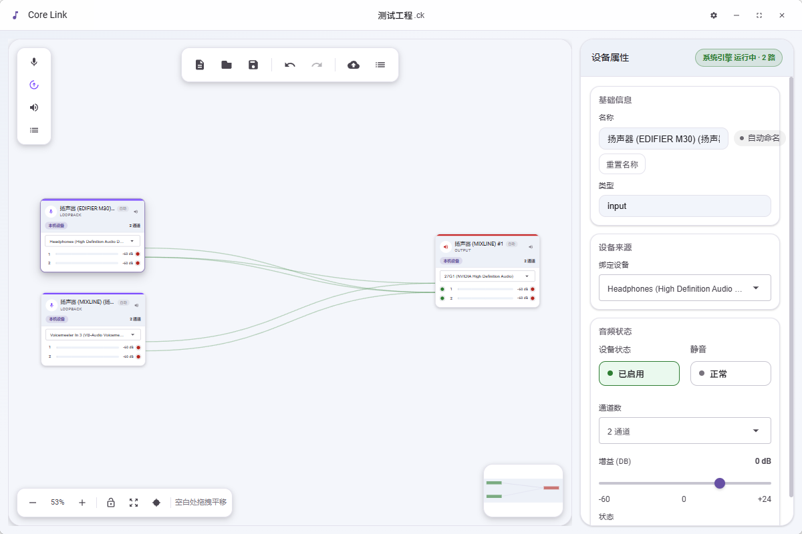

# Core Link

<p align="center">
  <strong>现代 UI 的专业音频路由软件</strong>
</p>

<p align="center">
  <a href="README_EN.md">English</a> | 中文
</p>

---

## 简介

Core Link 是一款现代 UI 的专业音频路由软件，灵感来源于 ASIO Link Pro。它提供了直观的可视化界面，让用户能够轻松创建和管理音频设备之间的连接。

## 主要功能

- **可视化路由画布**：拖拽式操作，直观展示音频信号流向
- **动态设备管理**：支持输入、输出和处理器（效果器）设备
- **智能自动布线**：一键自动连接设备，支持多对多路由
- **自动排版**：智能布局算法，自动排列设备位置
- **通道映射**：灵活的通道级连接控制
- **实时电平表**：实时监控音频信号强度
- **工程管理**：支持保存、加载和自动恢复工程
- **虚拟音频驱动**：内置虚拟音频设备支持



## 技术栈

- **前端**：React + TypeScript + Vite
- **桌面壳**：Tauri (Rust)
- **状态管理**：React Hooks
- **样式**：CSS Variables + Material Design

## 系统要求

- Windows 10/11
- 支持 ASIO 或 WASAPI 的音频设备

## 安装

```bash
# 克隆仓库
git clone https://github.com/yourusername/core-link.git
cd core-link

# 安装依赖
npm install

# 开发模式运行
npm run dev

# 构建生产版本
npm run build
```

## 使用指南

1. **创建设备**：从左侧设备面板拖拽输入/输出设备到画布
2. **建立连接**：点击设备的输出端口，拖拽到目标设备的输入端口
3. **自动布线**：点击工具栏"自动布线"按钮，系统将智能连接设备
4. **自动排版**：点击工具栏"自动排版"按钮，优化设备布局
5. **保存工程**：Ctrl+S 保存当前配置

## 快捷键

| 快捷键 | 功能 |
|--------|------|
| `Delete` / `Backspace` | 删除选中的设备或连线 |
| `Ctrl + S` | 保存工程 |
| `Ctrl + Z` | 撤销 |
| `Ctrl + Y` | 重做 |
| `Esc` | 取消选择 |
| `滚轮` | 缩放画布 |
| `空格 + 拖拽` | 平移画布 |

## 许可证

MIT License - 详见 [LICENSE](LICENSE) 文件

---

<p align="center">
  Made with ❤️ by Core Link Team
</p>
